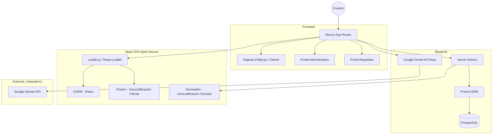

# Arquitectura del Sistema - Envios DosRuedas

Este documento describe la arquitectura técnica de la plataforma "Dos Ruedas Pro", detallando sus componentes, flujo de datos e integraciones.

## 1. Visión General

La aplicación es una plataforma de gestión logística de última milla construida con **Next.js 15+** (App Router), enfocada en la eficiencia operativa y la precisión visual en Mar del Plata.

### Diagrama de Arquitectura de Alto Nivel

## 2. Portales de Usuario

La plataforma se divide en tres ecosistemas principales:

1.  **Portal del Cliente**: Enfocado en la cotización dinámica, seguimiento de envíos en tiempo real y landing pages informativas.
2.  **Portal del Repartidor (Courier)**: Optimizado para dispositivos móviles, permite la gestión de hojas de ruta, cambio de estados de pedidos y escaneo de etiquetas.
3.  **Portal Administrativo**: Herramienta central para la gestión de órdenes, clientes, repartidores, y configuración de la matriz de precios.

## 3. Stack Tecnológico

-   **Framework**: Next.js (App Router, Server Components, Server Actions).
-   **Base de Datos**: PostgreSQL gestionado mediante Prisma ORM.
-   **IA**: Google Genkit para flujos de inteligencia (resumen de testimonios, generación de prompts).
-   **GIS (Sistemas de Información Geográfica)**:
    -   **Leaflet**: Renderizado de mapas interactivos.
    -   **OSRM**: Cálculo de rutas y distancias de conducción.
    -   **Photon**: Autocompletado de direcciones en el cliente (baja latencia).
    -   **Nominatim**: Geocodificación precisa en el servidor para validación de datos.
-   **Diseño**: Tailwind CSS bajo el sistema **Stitch Design System**, asegurando consistencia visual "Corporate/Modern".

## 4. Flujo de Datos Crítico

### Cotización y Creación de Órdenes
1.  El usuario ingresa direcciones en `/cotizar`.
2.  **Photon** provee sugerencias de direcciones filtradas por coordenadas de Mar del Plata.
3.  **OSRM** calcula la distancia real por calle.
4.  Una **Server Action** consulta el modelo `PriceRange` en la base de datos para determinar el costo.
5.  Al confirmar, se crea una entrada en el modelo `Order` y se genera una `Etiqueta` vinculada.

### Gestión de Repartidores
1.  El administrador asigna órdenes a un `Repartidor`.
2.  El repartidor accede a su dashboard en `/repartidor/[id]`.
3.  Actualiza los estados de la orden (`PENDIENTE` -> `EN_CURSO` -> `ENTREGADO`) mediante Server Actions que disparan actualizaciones en tiempo real para el cliente final.

## 5. Diseño para Impresión (A4)
El sistema implementa maquetación CSS estricta para asegurar que las etiquetas generadas en el portal administrativo se impriman perfectamente en formato A4, manteniendo la integridad de la información y los códigos de seguimiento.
